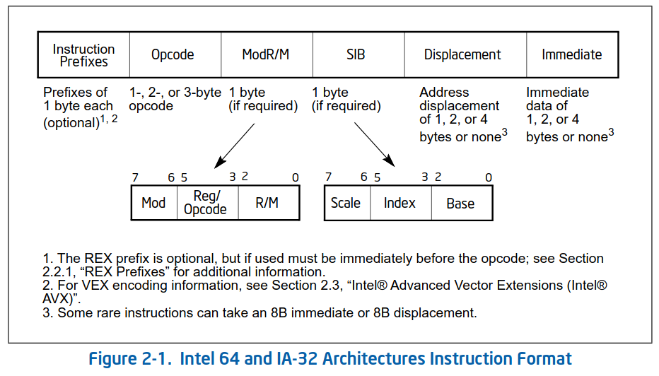
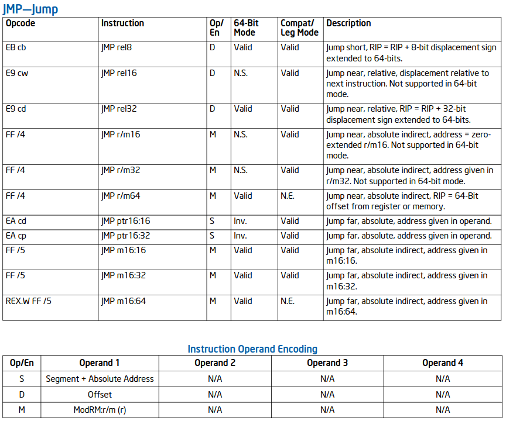

# x86 assembly

## Eléments de base

Il existe deux syntaxes pour l'assembleur x86 : 
- syntaxe Intel
- syntaxe AT&T
(voir [ici](https://imada.sdu.dk/u/kslarsen/dm546/Material/IntelnATT.htm) pour plus d'informations)

La notation [...] en syntaxe Intel désigne le contenu stocké à l'adresse indiquée entre les crochets (<=> déréférence).
Exemple : ```mov eax, [ebp - 4]``` => mettre dans ```eax``` le contenu en mémoire stocké à l'adresse "contenu de ```ebp``` - 4"

Une opérande peut être de 3 types : 
- *immédiate* : valeur constante
- *registre* : numéro de registre
- *mémoire* : adresse mémoire qui suit la syntaxe ```%segment:displacement(base, index, scale)```
	
Une instruction x86 peut prendre 0 à 4 opérandes.

Un mnémonique (ex : ```jmp```) est utilisé pour représenter de manière simple un ou des opcodes (FF, E9 etc.)

Types numériques : 
- *byte* : 1 octet (suffixe = *b*. Exemple : ```mov**b**```)
- *word* : 2 octets (suffixe = *w*. Exemple : ```mov**w**```)
- *double word* : 4 octets (suffixe = *l*. Exemple : ```mov**l**```)
- *quadruple word* : 8 octets (suffixe = *q*. Exemple : ```mov**q**```)
- *double quadruple word* : 16 octets

Dans le cas d'assembleurs qui utilisent la syntaxe AT&T (ex : GNU AS), un suffixe est ajouté au mnémonique d'une instruction : 
- *byte* : suffixe = *b*. Exemple : ```mov**b**```
- *word* : suffixe = *w*. Exemple : ```mov**w**```
- *double word* : suffixe = *l*. Exemple : ```mov**l**```
- *quadruple word* : suffixe = *q*. Exemple : ```mov**q**```
Attention : ne pas confondre avec ```movd``` (d n'est ici pas un suffixe mais une autre instruction que ```mov```) !

2 types de pointeurs : 
- *near pointer* : contient une adresse dans un segment (implicite)
- *far pointer* : contient une adresse dans un segment (explicite via un segment selector)
	
Effective address (= résultat de ce calcul) : ```base + (scale * index) + displacement```
	
Chaque registre est identifié par un numéro unique. 
Exemple : EAX = numéro 0, EBX = numéro 3, ECX = numéro 1 etc.

Une même instruction peut être représentée par plusieurs opcode. En effet, chaque opcode désigne une version différente de l'instruction (ex : version qui prend une opérande au lieu de deux)

Certaines intructions modifient le registre EFLAGS

TODO : Compatibility/Legacy Mode


## Anatomie d'une instruction assembleur convertie en binaire



Une instruction x86 en binaire est composée de 6 champs : 
- *Instruction prefixes* : champ optionnel mais certaines instructions nécessitent obligatoirement un préfixe. On peut placer un ou plusieurs préfixes au début d'une instruction pour indiquer des actions supplémentaires à réaliser. 
Il y a 4 groupes de préfixes : 
	- *groupe 1* : ```LOCK``` et ```REP``` 
	- *groupe 2* : utiliser un segment spécifique 
	- *groupe 3* : spécifier une taille 16 bits ou 32 bits pour les opérandes 
	- *groupe 4* : spécifier une taille 16 bits ou 32 bits pour les adresses 
- *Opcode* : identifiant unique d'une instruction assembleur. La longueur de ce champ peut être de 1, 2 ou 3 octets, et 3 bits supplémentaires peuvent être utilisés dans le champ *ModR/M* pour représenter l'opcode 
- *ModR/M* : ce champ, sur 1 octet, peut représenter deux opérandes, contient 3 sous-champs : 
	- *mod* : sur 2 bits, sa valeur indique ce que contient *r/m*. 
	On a : 
		- soit un registre (valeur = 11)
		- soit un mode d'adressage (valeur = 00, 01 ou 10)
	- *reg/opcode* : sur 3 bits, sa valeur peut indiquer : 
		- soit un numéro de registre (le registre est l'opérande source ou destination => dépend de l'instruction) 
		- soit pour ajouter 3 bits supplémentaires à l'opcode (permet de distinguer des instructions qui auraient le même opcode)
	- *r/m* : sur 3 bits, la signification de sa valeur dépend de la valeur de *mod* : 
		- soit un registre (le registre est l'opérande source ou destination => dépend de l'instruction)
		- soit un mode d'adressage
- *SIB* (Scale-Index-Base) : utilisé si les adresses sont de taille 32 bits et que le champ *ModR/M* possède une certaine valeur. 
Ce champ, sur 1 octet, contient 3 sous-champs : 
	- *scale* : sur 2 bits, indique le facteur utilisé pour obtenir un facteur (facteur = $2^{scale}$)
	- *index* : sur 3 bits, indique le numéro de registre utilisé comme index register
	- *base* : sur 3 bits, indique le numéro de registre utilisé comme base register
- *Displacement* : sur 1, 2 ou 4 octets, sa présence dépend de la valeur de *ModR/M* et de *SIB*, contient un offset qui est ajouté à l'adresse en mémoire calculée avec *base*, *index* et *scale*
- *Immediate* : sur 1, 2 ou 4 octets, sa présence dépend de l'instruction, contient l'éventuelle opérande immédiate utilisée par l'instruction


### Quelques exemples 

Utilisation de *nasm* pour assembler les instructions et écrire le code machine dans un fichier binaire (commande : ```nasm -f bin -o test test.asm```). Attention, *nasm* écrit par défaut des instructions sur 16 bits quand on écrit dans un fichier binaire !
 
- ```jmp [0x1234]``` 
On a en binaire : ```ff 26 34 12```
	- ```ff``` est un des opcodes possibles pour ```jmp``` => ```FF /4``` (voir page 622 du volume 2 du manuel Intel)
	- ```26``` = 00100110b est le champ *ModR/M*. 
	Voici la valeur de chaque sous-champ (taille d'adresse = 16 bits) : 
		- *mod* = 00b => mode d'adressage 
		- *reg/opcode* = 100b = 4 (comme indiqué par le ```/4```) => bits supplémentaires pour l'opcode
		- *r/m* = 110b, opérande = *disp16* = un champ *Displacement* sur 16 bits suit le champ *ModR/M*
	- ```3412``` : champ *Displacement* sur 16 bits, c'est 0x1234 en little-endian
	
- ```add eax, ecx``` 
On a en binaire : ```66 01 c8```
	- ```66``` : préfixe du groupe 3 (= operand-size override prefix) => utiliser la taille d'opérande qui n'est pas par défaut (utiliser des opérandes sur 32 bits car l'instruction est sur 16 bits)
	- ```01``` : est un des opcodes possibles pour ```add``` => ```01 /r``` (voir page 132 du volume 2 du manuel Intel)
	- ```c8``` = 11001000b est le champ *ModR/M*. 
	Voici la valeur de chaque sous-champ (taille d'adresse = 16 bits) : 
		- *mod* = 11b => registre
		- *reg/opcode* = 001b, opérande = registre ECX car 1 est le numéro associé à ce registre
		- *r/m* = 000b, opérande = registre EAX car 0 est le numéro associé à ce registre
	=> on obtient bien deux opérandes (registre dans *reg/opcode* et registre dans *r/m*) comme indiqué par le ```/r```
	
- ```jmp [eax*2 + ebx]``` 
On a en binaire : ```67 ff 24 43```
	- ```67``` : préfixe du groupe 4 (= address-size override prefix) => utiliser une taille d'adresse qui n'est pas par défaut (utiliser des adresses sur 32 bits car l'instruction est sur 16 bits)
	- ```ff``` est un des opcodes possibles pour ```jmp``` => ```FF /4``` (voir page 622 du volume 2 du manuel Intel)
	- ```24``` = 00100100b est le champ *ModR/M*. 
	Voici la valeur de chaque sous-champ (taille d'adresse = 32 bits du fait du préfixe) : 
		- *mod* = 00b => mode d'adressage 
		- *reg/opcode* = 100b = 4 (comme indiqué par le ```/4```) => bits supplémentaires pour l'opcode
		- *r/m* = 100b => un champ *SIB* suit
	=> la valeur des 3 champs indiquent qu'il y a un champ *SIB* qui suit
	- ```43``` = 01000011b = *SIB*. 
	Voici la valeur de chaque sous-champ : 
		- *scale* = 01b => facteur = 2
		- *index* = 000b => registre EAX car 0 est le numéro associé à ce registre
		- *base* = 011b registre EBX car 3 est le numéro associé à ce registre
	=> on obtient bien : eax * 2 + ebx

- ```jmp [eax * 4 + 0x1234]```
On a en binaire : ```67 ff 24 85 34 12 00 00```
	- ```67``` : préfixe du groupe 4 (= address-size override prefix) => utiliser une taille d'adresse qui n'est pas par défaut (utiliser des adresses sur 32 bits car l'instruction est sur 16 bits)
	- ```ff``` est un des opcodes possibles pour ```jmp``` => ```FF /4``` (voir page 622 du volume 2 du manuel Intel)
	- ```24``` = 00100100b est le champ *ModR/M*. 
	Voici la valeur de chaque sous-champ (taille d'adresse = 32 bits du fait du préfixe) : 
		- *mod* = 00b => mode d'adressage  
		- *reg/opcode* = 100b = 4 (comme indiqué par le ```/4```) => bits supplémentaires pour l'opcode
		- *r/m* = 100b => un champ *SIB* suit
	=> la valeur des 3 champs indiquent qu'il y a un champ *SIB* qui suit
	- ```85``` = 10000101b = *SIB*. 
	Voici la valeur de chaque sous-champ : 
		- *scale* = 10b => facteur = 4
		- *index* = 000b => registre EAX car 0 est le numéro associé à ce registre
		- *base* = 101b : comme *mod* = 00b => *disp32* = un champ *Displacement* sur 32 bits suit le champ *SIB* (il n'y a pas de registre mais une adresse comme base)
	- ```34 12 00 00``` : champ *Displacement*, c'est 0x1234 en little-endian (sur 32 bits car le préfixe 0x67 indique l'utilisation d'adresses sur 32 bits)
	
	
## Comprendre une instruction assembleur en détail (jmp)

Le volume 2 du manuel Intel met à disposition des explications détaillées sur chacune des instructions x86. Parmi ces explications se trouvent des tableaux dont une légende est donnée dans le section 3.1 du volume 2.

Voici les 2 tableaux associées à l'instruction ```jmp``` : 


Voyons ce que signifie chaque colonne du premier tableau (*Instruction Summary Table*) : 
- *Opcode* : indique la valeur de l'opcode en hexadécimal (ex : EB, E9, FF etc.) et des informations supplémentaires
	- *cb* (1 octet), *cw* (2 octets), *cd* (4 octets), *cp* (6 octets) etc. : une valeur d'une certaine taille suit directement l'opcode
	- */[0-7]* : indique que l'instruction ne possède qu'une seule opérande, celle-ci étant précisée par le sous-champ *r/m* de *ModR/M*. Cela signifie donc que le sous-champ *reg/opcode* contient des bits supplémentaires pour l'opcode : la valeur indiquée après le slash vaut la valeur en décimal de *reg/opcode*
	- */r* : indique que l'instruction possède deux opérandes
- *Instruction* : indique la syntaxe de l'instruction
	- *rel8* : offset (valeur signée) relativement à l'adresse de fin de l'instruction (octet directement après la fin de l'instruction = EIP), se trouve dans l'intervalle [EIP - 128, EIP + 127] 
	- *rel16*, *rel32* : offset (valeur signée) dans le même code segment que l'instruction (*rel16* s'applique aux instructions avec une taille d'opérandes à 16 bits et *rel32* pour une taille de 32 bits) 
	- *imm8*, *imm16*, *imm32*, *imm64* : cette opérande est de type immédiate (le numéro dépend de la taille des opérandes de l'instruction)
	- *ptr16:16*, *ptr16:32* : cette opérande est un pointeur qui pointe habituellement sur un code segment différent de l'instruction. La valeur de ce pointeur est divisée est deux parties. 
	- *m16:16*, *m16:32* : cette opérande est un far pointer. La valeur de ce pointeur est divisée en deux parties.
	- *r/m8*, *r/m16*, *r/m32*, *r/m64* : cette opérande est soit un registre général ou soit une opérande de type mémoire (le numéro dépend de la taille des opérandes de l'instruction)
	- *r8*, *r16*, *r32*, *r64* : cette opérande est un registre général
- *Op/En* : signifie Operand/Encoding, contient une lettre qui doit être utilisée comme index dans le tableau suivant qui s'appelle *Instruction Operand Encoding Table*
- *64-Bit/32-Bit Mode* : indique si cet opcode est supporté en mode 64 bits
- *Compat/Leg Mode* : indique si cet opcode est supporté dans le Compatibility/Legacy Mode
- *Description* : donne des informations sur l'instruction

Des paragraphes supplémentaires peuvent être présents : 
- *Operation* : pseudo-code de l'instruction
- *Flags affected* : liste des flags du registre EFLAGS qui sont affectés par l'instruction
- *Exceptions* : liste des exceptions qui peuvent survenir dans un mode d'exécution donné (ex : mode protégé)

Le deuxième tableau (*Instruction Operand Encoding Table*) donne des informations détaillées sur chacune des opérandes de l'instruction (ex : l'opérande peut être lue ( r ), écrite (w) ou les deux). 
Exemple : si la première opérande vaut *ModR/M:r/m ( r )*, cela siginifie qu'elle est renseignée dans le sous-champ *r/m* du champ *ModR/M* et que celle-ci n'est accessible qu'en lecture

Il existe 3 types de ```jmp``` : 
- near jump : saut vers une instruction qui se trouve dans le même code segment que le ```jmp``` (opérande = offset ou registre)
- short jump : saut vers une instruction qui se trouve dans l'intervalle [EIP - 128, EIP + 127] (opérande = offset)
- far jump : saut vers une instruction qui se trouve dans un segment différent du code segment de ```jmp``` (opérande = pointeur ou adresse mémoire) 


### Exemple 

Soit le programme suivant : 
```
main:
	jmp main
	jmp main2
	jmp main
main2:
	jmp 0x1234
```

On obtient le code binaire suivant : 
```eb fe eb 02 eb fa e9 2b 12```

Premier ```jmp``` : 
	- ```eb``` : ```jmp``` qui est suivie d'une valeur sur 1 octet qui est un *rel8*
	- ```fe``` = 11111110b = 254 (non-signé) = -2 (complément à 2) => *rel8* (= offset à partir de la valeur courante du registre EIP)
	
Deuxième ```jmp``` : 
	- ```eb``` : ```jmp``` qui est suivie d'une valeur sur 1 octet qui est un *rel8*
	- ```02``` = +2 => *rel8* (= offset à partir de la valeur courante du registre EIP)

Troisième ```jmp``` : 
	- ```eb``` : ```jmp``` qui est suivie d'une valeur sur 1 octet qui est un *rel8*
	- ```fa``` = 11111010b = 250 (non-signé) = -6 (complément à 2) => *rel8* (= offset à partir de la valeur courante du registre EIP)

Quatrième ```jmp``` : 
	- ```e9``` : ```jmp``` qui est suivie d'une valeur sur 2 ou 3 octets (ici, les opérandes de l'instruction sont sur 16 bits = 2 octets => *rel16*)
	- ```2b12``` : *rel16* (= offset depuis la fin de ce ```jmp```). Ici, si EIP = 0x9, on a : 0x9 + 0x122b (big endian) = 0x1234 


## Quelques instructions

### mov
On ne peut pas réaliser un ```mov``` avec deux opérandes de type mémoire ! Si on souhaite faire cela, on aura besoin de réaliser deux ```mov``` : un de la mémoire vers un registre et un autre du registre vers la mémoire
Il existe la variante ```movzx``` qui copie l'opérande source vers l'opérande de destination (taille opérande source inférieure à taille opérande destination) en remplissant de 0 les bits supplémentaires de l'opérande de destination

### lea
Utilisée par exemple pour réaliser des opérations arithmétiques sur le contenu d'un registre.
Exemple : post-incrémentation 
```
Disassembly of section .text:

int i1 = i++;
    122f:	mov    eax,DWORD PTR [rbp-0x64] #eax=i
    1232:	lea    edx,[rax+0x1] #edx=i+1
    1235:	mov    DWORD PTR [rbp-0x64],edx #i=edx=i+1
    1238:	mov    DWORD PTR [rbp-0x10],eax #i1=i
```

Si on avait voulu faire un ```mov``` dans edx à la place, on aurait dû ajouter un ```add``` en plus.

Attention, la syntaxe de ```lea``` porte à confusion : ```lea    edx,[rax+0x1]``` ne veut pas dire "mettre dans edx le contenu stocké à l'adresse rax+0x1" mais plutôt "mettre dans edx la valeur contenue dans rax+0x1" !

Plus d'informations 
[ici](https://stackoverflow.com/questions/1699748/what-is-the-difference-between-mov-and-lea) et 
[ici](https://stackoverflow.com/questions/35475396/what-is-the-difference-between-mov-and-lea-in-terms-of-retrieving-an-address).

### cdq et idiv
```cdq``` copie le signe de la valeur contenue dans EAX (bit de poids le plus fort = bit 31) dans tous les bits de EDX. 

A ne pas confondre avec ```cdqe``` ! 
Il faut utiliser ```cdq``` avant ```idiv``` car l'on souhaite effectuer une division signée (voir [ici](https://stackoverflow.com/questions/36464879/when-and-why-do-we-sign-extend-and-use-cdq-with-mul-div) pour plus d'informations)

Lexique de la division euclidienne : 
- dividende : nombre que l'on divise
- diviseur : nombre qui divise le dividende
- quotient : un des 2 résultats (nombre de fois qu'il y a le diviseur dans le dividende)
- reste : un des 2 résultats 
Exemple : 30 (dividende) = 7 (diviseur) * 4 (quotient) + 2 (reste)

```idiv``` a la particularité de ne prendre qu'une seule opérande => le diviseur. Le dividende est la paire EDX:EAX, avec EAX une valeur et EDX le signe de la valeur contenue dans EAX (EDX rempli avec ```cdq```).
```idiv``` donne deux résultats : le quotient et le reste de la division. Le quotient est placé dans EAX et le reste dans EDX

### shl/sal
Décalage de l'opérande source de x bits vers la gauche, les "nouveaux" bits étant des 0.
```shl``` et ```sal``` sont des synonymes : ces deux mnémoniques sont strictement équivalents (complétude car dans le cas d'un décalage à droite, il y a une distinction entre ```shr``` et ```sar```) (voir [ici](https://stackoverflow.com/questions/8373415/difference-between-shl-and-sal-in-80x86) et la section 7.3.6.1 du volume 1 pour plus d'informations)

### shr/sar
Attention : ```shr``` et ```sar``` ne sont pas des synonymes ! 

Décalage de l'opérande source de x bits vers la droite, les "nouveaux" bits étant des 0 pour ```shr```, et soit des 0 ou des 1 pour ```sar``` selon la valeur initiale du signe 
=> si le signe était positif (bit de poids le plus fort de l'opérande = 0), alors les "nouveaux" bits seront des 0
=> si le signe était négatif (bit de poids le plus fort de l'opérande = 1), alors les "nouveaux" bits seront des 1

Voir la section 7.3.6.1 du volume 1 pour plus d'informations

### cmp et EFLAGS
```cmp``` compare deux opérandes et marque le résultat dans un status flag de EFLAGS.
Exemple : si on fait un ```cmp``` entre deux opérandes égales, le flag ```ZF``` de EFLAGS sera mis à 1
Voir Appendix B du volume 1 pour plus d'informations

### SETcc
Mettre à 0 ou 1 un registre ou opérande mémoire selon le status flag de EFLAGS souhaité (cc est à remplacer par le suffixe souhaité).
Exemple : ```sete al``` met le sous-registre al à 1 si le status flag ZF de EFLAGS est à 1 ou à 0 sinon


